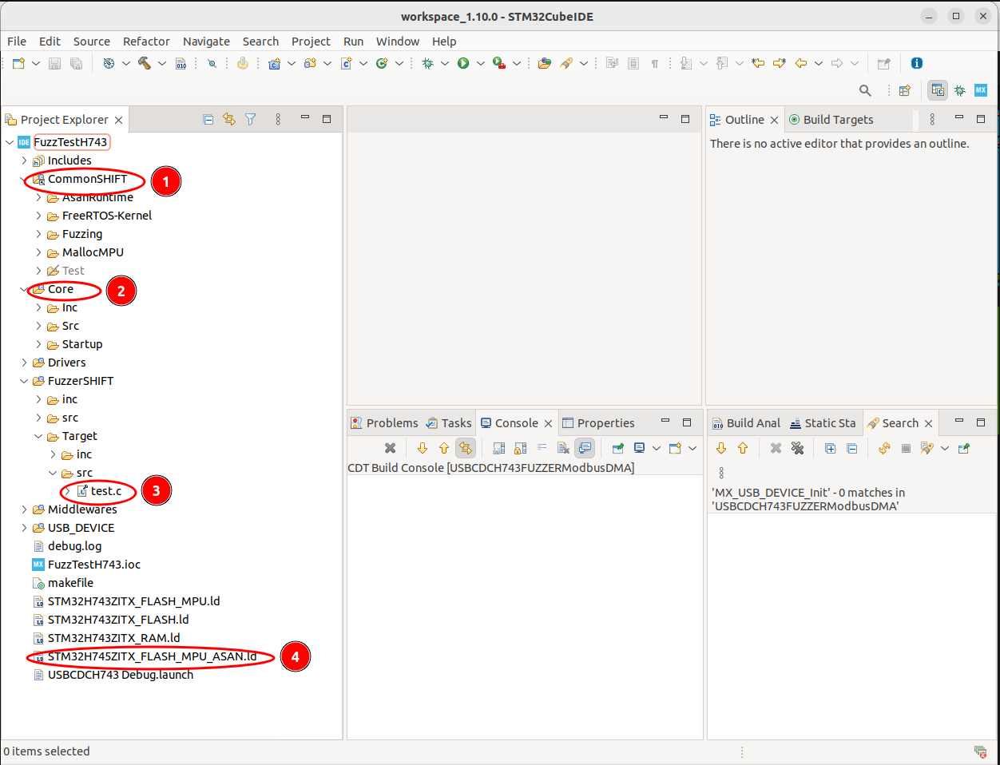

# SHiFT
SHiFT: Semi-hosted Fuzz Testing for Embedded Applications

This is the repository of our paper SHiFT under submission in The Network and Distributed System Security (NDSS) Symposium 2023.


# Getting Started
SHiFT requires the following software and hardware components:
* A workstation running Ubuntu (18.04/20.04/22.04) 64bit LTS
* GCC compiler
* Python 3.7+ 
* Pyserial 
* Embedded ARM crosscompiler toolchain
* STM32CubeIDE (https://www.st.com/en/development-tools/stm32cubeide.html)
* libserialport (https://sigrok.org/wiki/Libserialport)
* Development boards NUCLEO-H745ZI and/or NUCLEO-H743ZI by ST Microelectronics
* A USB 3.0 hub or at least 2 free USB ports in the workstation 
* 2 micro USB cables for each development board added to the cluster 

The STM32CubeIDE is freely available on ST Microlectronics website for registered users. The user must register, download and install this IDE accepting the corresponding vendor's license agreements. Besides, SHiFT is based on many open source projects that are either added as submodules or directly included in this repository. 


For cloning and initializing this repository use the following command:

```bash
git clone git@github.com:RiS3-Lab/SHiFT.git
cd SHiFT
git submodule update --init --recursive

```

After cloning and initializing all sub-modules the directory structure of SHiFT will be as follows:

```
.
├── AFL                                                                 # Modified version of AFL supporting serial port
├── helpers                                                             # Helping tools to test the fuzzing cluster
├── libserialport                                                       # Cross-platform serial port library (submodule)
├── LICENSE                                                             # License file          
├── README.md                                                           # this file
├── SHiFTcode                                                           # Main SHiFT directory          
│   ├── cloner.sh                                                       # helper script to clone a template
│   ├── CommonSHIFT                                                     # Runtimes, FreeRTOS kernel, fuzzing routines
│   ├── Template-USBCDCH743FUZZER                                       # Template project for NUCLEO-H743 single-core
│   ├── Template-USBCDCH745FUZZDC                                       # Template project for NUCLEO-H745 dual-core
│   ├── Template-USBCDCH745FUZZER                                       # Template project for NUCLEO-H745 single-core
│   ├── USBCDCH74x
└── toolchains
    ├── gcc-arm-none-eabi-10.3-2021.12-0x24000000-0x10000000.tar.bz2    # Precompiled toolchain for dual-core templates
    └── gcc-arm-none-eabi-10.3-2021.12-0x24000000.tar.bz2               # Precompiled toolchain for single-core templates

```


## Compiling and Installing common prerequisites


```bash
# install GCC compiler
sudo apt install build-essential

cd SHiFT

# installing libserialport
cd libserialport
./autogen.sh
./configure
make
sudo make install
cd ..

# decompresing the embedded toolchains
cd toolchains
mkdir gcc-arm-none-eabi-10.3-2021.12-0x24000000
tar -xvf gcc-arm-none-eabi-10.3-2021.12-0x24000000.tar.xz -C ./gcc-arm-none-eabi-10.3-2021.12-0x24000000
mkdir gcc-arm-none-eabi-10.3-2021.12-0x24000000-0x10000000
tar -xvf gcc-arm-none-eabi-10.3-2021.12-0x24000000-0x10000000.tar.xz -C ./gcc-arm-none-eabi-10.3-2021.12-0x24000000-0x10000000
cd ..
# installing pyserial
pip install pyserial

```

## Specific instructions for compiling AFL 

### Example 

```bash
cd SHiFT
cd AFL
usb_input_max=512 bms_pow2=16 make
```
### Parameters

1.  *usb_input_max:* speficifies the maximum length of mutated input AFL should send to the MCU
2.  *bms_pow2:* specifies the bitmap size used by AFL, e.g., 16 means 65535 bytes
3.  Optionally add `PROFILE=1` before the *make* command to generate profiling data


### AFL working with serial ports
In the original AFL, each fuzzing iteration comprises of 
1. writing the current mutated input to a file 
2. execute the target (which is programmed to receive input from the file)

As in SHiFT's case, step 1 is replaced with sending the mutated input through the serial port which is [here](https://github.com/RiS3-Lab/SHiFT/blob/main/AFL/afl-fuzz.c#L2484).

And step 2 is replaced with waiting for the MCU to send back the feedback which is 
[here](https://github.com/RiS3-Lab/SHiFT/blob/main/AFL/afl-fuzz.c#L2403)

Since the coverage feedback sent back from the MCU are in pairs of hit edges, 
instead of reconstructing a bitmap, we direct use these pairs to find interesting edges, saving us some time.
This part is [here](https://github.com/RiS3-Lab/SHiFT/blob/main/AFL/afl-fuzz.c#L996)


## Installing toolchains in STM32CubeIDE
SHiFT uses modified embedded toolchains to support specific locations of the shadow memory for ASAN, as described in the implementation section of our paper. The original source code of the toolchain can be obtained from ARM website and compiled for particular offsets according the the user's needs (https://developer.arm.com/downloads/-/arm-gnu-toolchain-downloads). Compiling the toolchain might take several hours. Therefore, we provide 2 precompiled toolchains with specific offsets also detailed in our paper in Table III.

To install the toolchains execute STM32CubeIDE and follow the next steps:
1. Navigate in the bar menu to *File->Properties*, or press Ctrl+Enter
2. On the left pane, expand *C/C++ Build* and select *Settings*, under the *Tool Settings* pane select *MCU Toolchain* 
and click the *Open Toolchain Manager...* button as 
depicted in the following picture:


3. Click the *Add Local* button 


3. Register two local toolchains using the decompressed toolchains provided in this repository. For the name field you need to use *GNU ARM embedded shadow 0x24000000* or *GNU ARM embedded shadow 0x24000000-0x10000000*, the prefix should be in both cases *arm-none-eabi-*, and the location should be the *bin* directory inside of the corresponding decompressed toolchain folder.
 


# Fuzzing firmware with SHiFT
We provide three preconfigured templates: two for single-core (for NUCLEO-H743 and NUCLEO-H745, respectively) and one for dual-core (for NUCLEO-H745ZI, exclusively). The templates are complete preconfigured projects that can be imported directly into STM32CubeIDE.

## Cloning and importing templates
We recommend not working directly on the templates. Instead, we provide a cloner script that allows 
cloning the templates maintaining all the preconfigured characteristics and avoiding naming conflicts in the IDE.
Do not duplicate a template copying directly the template folder. Use always the cloner script.  

### Example
```bash
## cloning a template
cd SHiFT/SHiFTcode

#USAGE: ./cloner -s [source] -d [destination] 
# source and destination should be at the same level in the SHiFTcode folder
./cloner.sh -s ./Template-USBCDCH743FUZZER -d ./FuzzTestH743 

```

## Importing the cloned template and configuring the fuzzing target
To import the cloned template execute STM32CubeIDE and follow the next steps:
1. Navigate in the menu bar to *File->Open Projects from file system*
2. In the window dialog navigate to the folder of the cloned template and click finish


3. Navigate to the imported template in the *Project Explorer* pane. The details of each folder are as follows: (1) contains files shared between all templates and might nood need modifications for each fuzzing campaign. (2) Contains initialization routines of the MCU and specific configuration of the fuzzer and FreeRTOS kernel, it is normally modified for each fuzzing campaign (3) This is the fuzzing target, (4) this is the modified linker script to support ASAN and its shadow memory.



4. Right-click on the *test.c* file and navigate to the *Properties* option in the contextual menu.

5. Activate the SANCOV and ASAN compilation flags for the *test.c* file. The *-fno-common* flag is also necessary for ASAN instrumention as depicted in the following picture:


6. Compile the imported template 


```bash
AFL_SKIP_CPUFREQ=1 AFL_NO_FORKSRV=1 ./afl-fuzz -c /dev/ttyACM1 -w 9600 -t 5000 -i ./test/in -o ./test/out 2>err.txt
```

1. *AFL_NO_FORKSRV=1* since we don't need the forkserver
2. *-c* specifies the device file name for the serial port to use
3. *-w* specifies the baud rate for the serial port, if it needs to be set.
4. *-t* timeout in ms, specifies how much time to wait before deciding the MCU is dead
5. it's good practice to write the stderr to a file, since the error information can be useful


