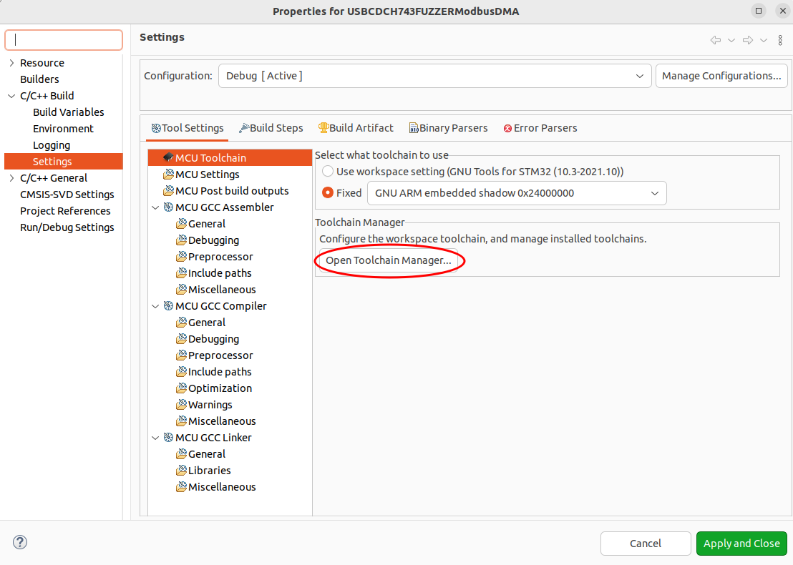
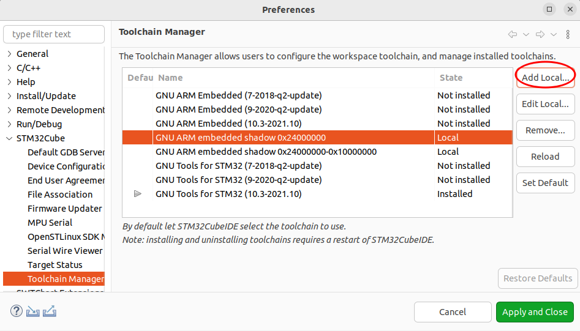
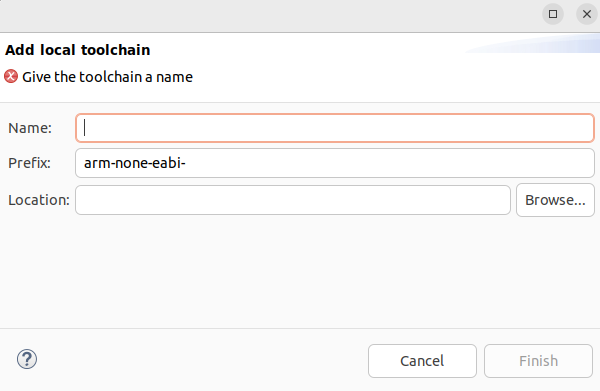
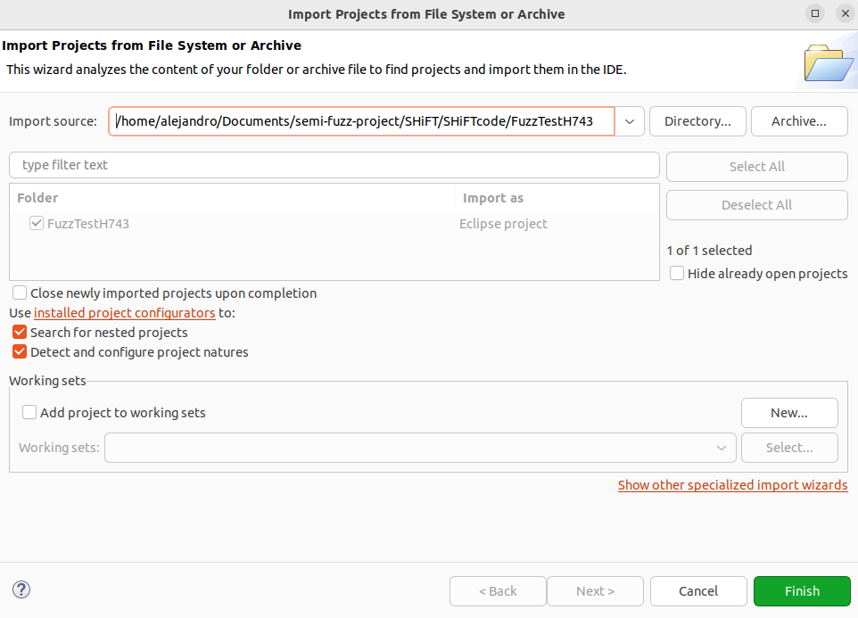
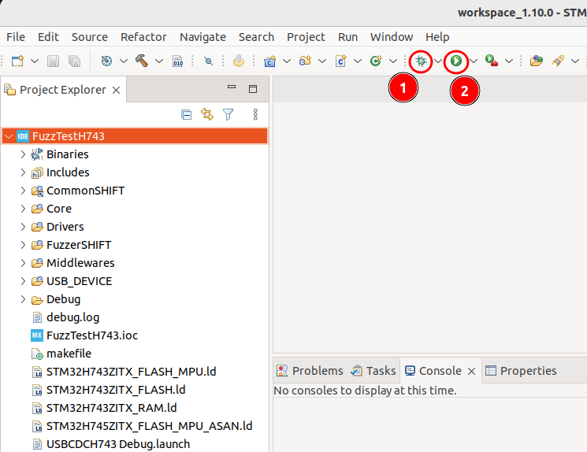
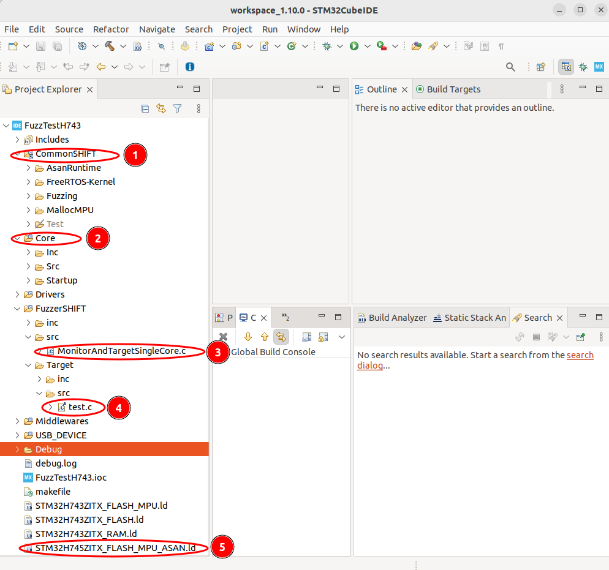
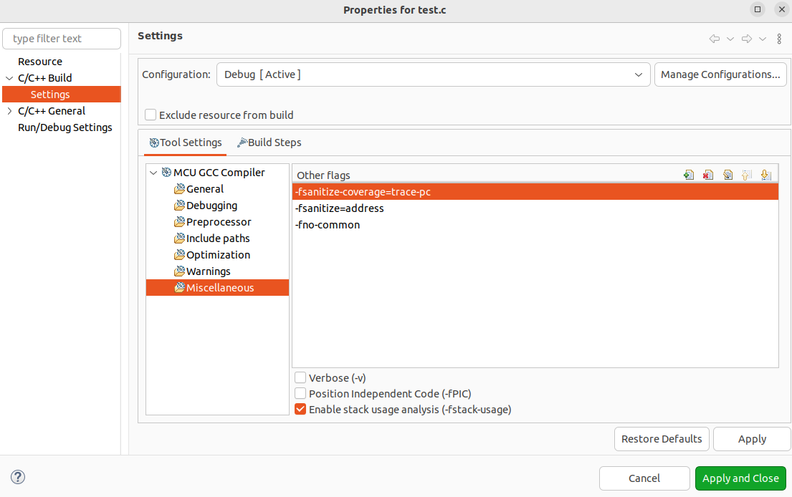
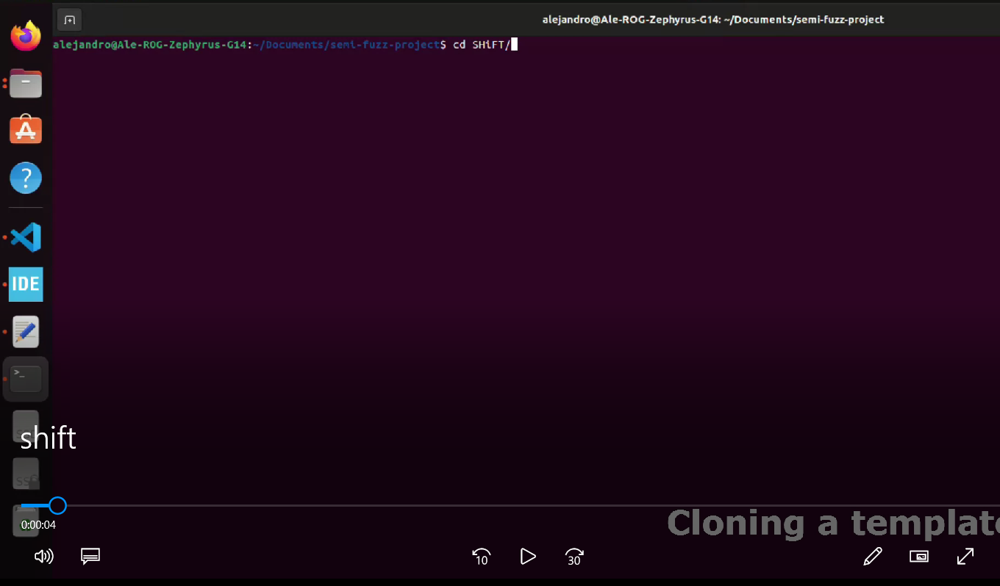

# SHiFT
SHiFT: Semi-hosted Fuzz Testing for Embedded Applications

This is the repository of our paper presented at the 33rd Usenix Security Symposium  https://www.usenix.org/conference/usenixsecurity24/presentation/mera.

If you use this work or parts of it, please cite our paper as follows:

```
@inproceedings {298010,
author = {Alejandro Mera and Changming Liu and Ruimin Sun and Engin Kirda and Long Lu},
title = {{SHiFT}: Semi-hosted Fuzz Testing for Embedded Applications},
booktitle = {33rd USENIX Security Symposium (USENIX Security 24)},
year = {2024},
isbn = {978-1-939133-44-1},
address = {Philadelphia, PA},
pages = {5323--5340},
url = {https://www.usenix.org/conference/usenixsecurity24/presentation/mera},
publisher = {USENIX Association},
month = aug
}

```


This readme file contains the following sections:
- A. [Getting Started](#a-getting-started)
- B. [Fuzzing firmware with SHiFT](#b-fuzzing-firmware-with-shift)
- C. [Video demo](#c-video-demo-of-shift-fuzzing-the-testing-program)
- D. [Disclaimer] 
 
Each section describes steps to set up and use our framework. We also provide some technical details that were not
included in our paper. Nevertheless, our paper should be also used as a complement of this README file.
We recommend following our instructions in the particular order described in this file.


# A. Getting Started
SHiFT requires the following software and hardware components:
* A workstation running Ubuntu (18.04/20.04/22.04) 64bit LTS
* GCC compiler
* Python 3.7+ 
* Pyserial 
* cutecom
* Embedded ARM cross-compiler toolchain
* STM32CubeIDE (https://www.st.com/en/development-tools/stm32cubeide.html)
* libserialport (https://sigrok.org/wiki/Libserialport)
* Development boards NUCLEO-H745ZI and/or NUCLEO-H743ZI by ST Microelectronics
* A USB 3.0 hub or at least 2 free USB ports in the workstation 
* 2 micro USB cables for each development board added to the cluster 

The STM32CubeIDE is freely available on ST Microlectronics website for registered users. The user must register, download and install this IDE accepting the corresponding vendor's license agreements. Besides, SHiFT is based on many open source projects that are either added as submodules or directly included in this repository. 


For cloning and initializing this repository use the following command:

```bash
git clone git@github.com:RiS3-Lab/SHiFT.git
cd SHiFT
git submodule update --init --recursive

```

After cloning and initializing all sub-modules the directory structure of SHiFT will be as follows:

```
.
├── AFL                                                                 # Modified version of AFL supporting serial port
├── helpers                                                             # Helping tools to test the fuzzing cluster
├── libserialport                                                       # Cross-platform serial port library (submodule)
├── LICENSE                                                             # License file          
├── README.md                                                           # this file
├── SHiFTcode                                                           # Main SHiFT directory          
│   ├── cloner.sh                                                       # helper script to clone a template
│   ├── CommonSHIFT                                                     # Runtimes, FreeRTOS kernel, fuzzing routines
│   ├── Template-USBCDCH743FUZZER                                       # Template project for NUCLEO-H743 single-core
│   ├── Template-USBCDCH745FUZZDC                                       # Template project for NUCLEO-H745 dual-core
│   ├── Template-USBCDCH745FUZZER                                       # Template project for NUCLEO-H745 single-core
│   ├── USBCDCH74x
└── toolchains
    ├── gcc-arm-none-eabi-10.3-2021.12-0x24000000-0x10000000.tar.bz2    # Precompiled toolchain for dual-core templates
    └── gcc-arm-none-eabi-10.3-2021.12-0x24000000.tar.bz2               # Precompiled toolchain for single-core templates

```


## Configuring, compiling and Installing common prerequisites


```bash
#install GCC compiler and other required packages
sudo apt install build-essential make cutecom

cd SHiFT

#installing libserialport
cd libserialport
./autogen.sh
./configure
make
sudo make install
cd ..

#decompresing the embedded toolchains
cd toolchains
mkdir gcc-arm-none-eabi-10.3-2021.12-0x24000000
tar -xvf gcc-arm-none-eabi-10.3-2021.12-0x24000000.tar.xz -C ./gcc-arm-none-eabi-10.3-2021.12-0x24000000
mkdir gcc-arm-none-eabi-10.3-2021.12-0x24000000-0x10000000
tar -xvf gcc-arm-none-eabi-10.3-2021.12-0x24000000-0x10000000.tar.xz -C ./gcc-arm-none-eabi-10.3-2021.12-0x24000000-0x10000000
cd ..

#installing pyserial
pip install pyserial

#add the current user to the dialout group
#this is necessary to access the serial ports in the linux system without root privileges

sudo adduser $USER dialout

#the new group privileges will only work after rebooting the system 
sudo reboot now
```

## Specific instructions for compiling AFL 

### Example 

```bash
cd SHiFT/AFL
usb_input_max=512 bms_pow2=16 make
```
### Parameters

1.  *usb_input_max:* speficifies the maximum length of mutated input AFL should send to the MCU
2.  *bms_pow2:* specifies the bitmap size used by AFL, e.g., 16 means 65535 bytes
3.  Optionally add `PROFILE=1` before the *make* command to generate profiling data


### AFL working with serial ports
In the original AFL, each fuzzing iteration comprises of 
1. writing the current mutated input to a file 
2. execute the target (which is programmed to receive input from the file)

As in SHiFT's case, step 1 is replaced with sending the mutated input through the serial port which is [here](https://github.com/RiS3-Lab/SHiFT/blob/main/AFL/afl-fuzz.c#L2484).

And step 2 is replaced with waiting for the MCU to send back the feedback which is 
[here](https://github.com/RiS3-Lab/SHiFT/blob/main/AFL/afl-fuzz.c#L2403)

Since the coverage feedback sent back from the MCU are in pairs of hit edges, 
instead of reconstructing a bitmap, we directly use these pairs to find interesting edges and save some time.
This part is [here](https://github.com/RiS3-Lab/SHiFT/blob/main/AFL/afl-fuzz.c#L996)


## Installing toolchains in STM32CubeIDE
SHiFT uses modified embedded toolchains to support specific locations of the shadow memory for ASAN, as described in the implementation section of our paper. The original source code of the toolchain can be obtained from ARM website and compiled for particular offsets according the user's needs (https://developer.arm.com/downloads/-/arm-gnu-toolchain-downloads). Compiling the toolchain might take several hours. Therefore, we provide 2 precompiled toolchains with specific offsets also detailed in our paper in Table III.

To install the toolchains execute STM32CubeIDE and follow the next steps:
1. Navigate in the bar menu to *File->Properties*, or press Ctrl+Enter
2. On the left pane, expand *C/C++ Build* and select *Settings*, under the *Tool Settings* pane select *MCU Toolchain* 
and click the *Open Toolchain Manager...* button as 
depicted in the following picture:




3. Click the *Add Local* button 



3. Register two local toolchains using the decompressed toolchains provided in this repository. For the name field you need to use *GNU ARM embedded shadow 0x24000000* or *GNU ARM embedded shadow 0x24000000-0x10000000*, the prefix should be in both cases *arm-none-eabi-*, and the location should be the *bin* directory inside the corresponding decompressed toolchain folder.
 



# B. Fuzzing firmware with SHiFT
We provide three pre-configured templates for fuzzing: two for single-core (for NUCLEO-H743 and NUCLEO-H745, respectively) and one for dual-core (for NUCLEO-H745ZI, exclusively). The templates are complete projects that can be imported directly into STM32CubeIDE.

## Cloning and importing templates
We recommend not working directly on the templates. Instead, we provide a script [here](https://github.com/RiS3-Lab/SHiFT/blob/main/SHiFTcode/cloner.sh) that allows cloning the templates maintaining all the preconfigured characteristics and avoiding naming conflicts in the IDE.
Do not duplicate a template copying directly the template folder. Use always the cloner script.  

### Example
```bash
#cloning a template
cd SHiFT/SHiFTcode

#USAGE: ./cloner -s [source] -d [destination] 
#source and destination should be at the same level in the SHiFTcode folder
./cloner.sh -s ./Template-USBCDCH743FUZZER -d ./FuzzTestH743 

```

## Importing and compiling the cloned template
To import the cloned template execute STM32CubeIDE and follow the next steps:
1. Navigate in the menu bar to *File->Open Projects from file system*
2. In the window dialog navigate to the folder of the cloned template and click finish



3. Navigate to the imported template in the *Project Explorer* and click the root node of the project to select it.
4. Connect the development board to the workstation. We need two USB connections, the first one connected directly to the *ST-Link* and the second to *User USB* connector. Check the 
corresponding development board manual for more details (https://www.st.com/resource/en/user_manual/um2407-stm32h7-nucleo144-boards-mb1364-stmicroelectronics.pdf). 
5. Click the *bug* button (1 in the next figure) to compile, flash and *debug* the development board.  Click the *Play* button (2 in the next figure) to compile, flash and *execute* the firmware on the development board. 




## Details of the imported template
The imported template contains common files shared between all the templates, and specific files 
and configurations for each board or configuration mode (i.e., Single or Dual-core) as depicted in the following figure:




The details of the imported files are as follows: 

1. *CommonSHIFT* contains files shared between all the templates including the runtimes, the FreeRTOS-Kernel with SHiFT extensions, Fuzzing routines to manage the communication protocol with the workstation and an experimental malloc function protected by the MPU. This last component is experimental and not documented in our paper. The files in this folder should not be modified, unless 
it is necessary to update all the templates.
2. *Core* contains initialization routines of the MCU and specific configurations for the components of the *CommonSHIFT* folder.
3. *Test.c* is the target program that we aim to fuzz testing. In this particular case, it is the 
*Testing program* also documented in the appendix of our paper. This file requires the activation of the corresponding compilation
flags to activate ASAN and SANCOV as depicted in the following picture of the porperties dialog.




4. This is the modified linker script of the firmware with support for ASAN shadow memory.

### Note:
We also provided pre-configured examples of the case studies that we presented in our paper.
Some of them requires physical external connections and might not be launched directly.
We recommend reading the comments of the source code and the details of our paper 
to configure the hardware accordingly.


## Starting the fuzzing campaign

At this point, we assume the required software and hardware is ready to start a fuzzing campaign.
Please check the steps in the [Getting started](#a-getting-started) before continuing.


Before starting the fuzzing campaign, make sure that the template is flashed and ready for *execution* as described 
in section [Importing and compiling the cloned template](#importing-and-compiling-the-cloned-template). Also,
verify on which TTY device the workstation OS mounted the SHiFT's virtual serial port. It is worth noting that
the ST-Link USB connection is a composite device that also enables a virtual serial port on the workstation. To identify
the specific serial port used for fuzzing, we recommend disconnecting and connecting the *user USB* cable of the development
board and verify the name of the mounted serial port.
We provide [here](https://github.com/RiS3-Lab/SHiFT/blob/main/helpers/serialList.py) a helper script to verify the name of the
mounted serial ports. This script and the fuzzing session do not require root privileges. Otherwise, check the section [common prerequisites](#configuring-compiling-and-installing-common-prerequisites) for more details.

### Example to verify the serial port name
```bash
cd SHiFT/helpers

./serialList.py
#sample output before connecting the user USB port: 
#['/dev/ttyACM0'] --> this is the ST-link Virtual serial port

./serialList.py
#sample output after connecting the user USB port: 
#['/dev/ttyACM1', '/dev/ttyACM0'] --> The SHiFT and ST-link Virtual serial ports
```

### Example to start the fuzzing session

```bash
cd SHiFT/AFL
#create a folder for the fuzzing campaign
mkdir -p ./test/in
#provide a seed input 
cp ./SeedSHiFT/1.txt ./test/in
#Happy fuzzing =) 
AFL_SKIP_CPUFREQ=1 AFL_NO_FORKSRV=1 ./afl-fuzz -c /dev/ttyACM1 -w 9600 -t 5000 -i ./test/in -o ./test/out 2>err.txt
```
### Parameters:

1. *AFL_NO_FORKSRV=1* mandatory, since we don't need the forkserver.
2. *AFL_SKIP_CPUFREQ=1* optional and only necessary if the user has no root access to change the kernel parameters required by AFL (https://github.com/mirrorer/afl/blob/master/docs/env_variables.txt). Adding this parameter will slightly reduce AFL performance.
2. *-c* specifies the name of the serial port used for fuzzing
3. *-w* specifies the baud rate for the serial port. If the development board uses a Virtual Serial port over USB, as in our case, the baud rate has no impact on the actual fuzzing speed, but it is necessary to launch the fuzzing session. 
4. *-t* timeout in ms, specifies how much time to wait before deciding the MCU has entered a non-recoverable state. This delay is specific to the firmware that is being fuzzed and should be adjusted accordingly.
5. We recommend writing the stderr to a file err.txt, so it can be used later to analyze the events of the fuzzing campaign. 

### Notes:
- We configured the ST-Link serial port as an output console terminal for printing messages of the ASAN runtime and the Monitor running on the MCU. 
The user can open the ST-Link serial port in a terminal emulator to see the messages printed. The baud rate of the serial port is 7500000. 
We recommend using *cutecom* as the terminal emulator. 
- The test.c program contains ten synthetic bugs and one hang (eleven defects in total). SHiFT will be able to identify all of them in 6 or fewer minutes 
using the setup described in our paper. 


# C. Video Demo of SHiFT fuzzing the testing program

This video shows the complete process starting from a template pre-configured to 
fuzz the test.c file documented in our paper.

<a href="https://user-images.githubusercontent.com/16860024/190512345-a374573a-7188-4b99-a8da-6c65e75ccc1a.webm" title="SHiFT Demo"></a>


# D. Disclaimer 

This repository is `work in progress` you can find the port described in our paper for the Cortex-M architecture. The port for the Xtensa architecture will be open sourced soon.
You can find the latest version of our work under the `revision2023` branch, in particular you can find the proxy described in SHiFT to support AFL++ and other mutating engines. 
However, we recommend to use AFL according to the instructions detailed in the main branch since we found it more stable, we are debugging the proxy.


